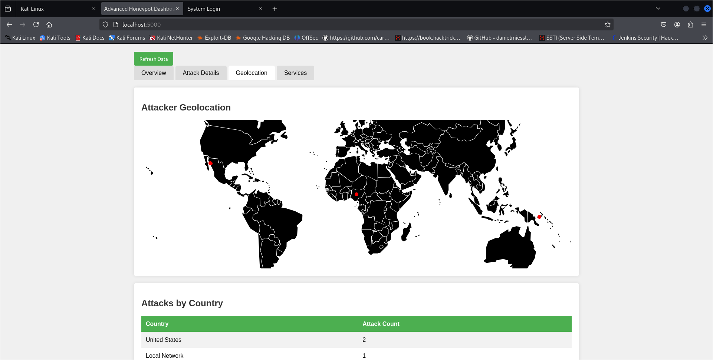

# Advanced Kali Linux Honeypot System

A sophisticated multi-service honeypot solution designed for Kali Linux that detects, logs, and analyzes network intrusion attempts while providing real-time visualization of attack patterns.

## Features

- **Multi-Service Honeypot**: Simulates SSH, Web, FTP, and Telnet services to attract and monitor different types of attacks
- **Geolocation Tracking**: Maps attacker locations around the world using IP geolocation
- **Interactive Dashboard**: Real-time monitoring interface with attack statistics and visualizations
- **Attack Analysis**: Detailed logging and analysis of usernames, passwords, and attack patterns
- **Service Monitoring**: Status tracking of all honeypot services

## Screenshots





## Prerequisites

- Kali Linux (2023.1 or newer)
- Python 3.x
- Root privileges (for binding to privileged ports)

## Installation

1. Clone this repository:
```bash
git clone https://github.com/Malkitgahlawat/Advance_honeypot.git
cd kali-honeypot
```

2. Run the setup script:
```bash
sudo ./setup.sh
```

## Usage

### Starting the Honeypot

```bash
sudo ./scripts/start_honeypot.sh
```

This will start:
- SSH honeypot on port 2222
- Web honeypot on port 8080
- FTP honeypot on port 2121
- Telnet honeypot on port 2324
- Dashboard on port 5000

### Accessing the Dashboard

Open your browser and navigate to:
```
http://localhost:5000
```

### Stopping the Honeypot

```bash
sudo ./scripts/stop_honeypot.sh
```

### Analyzing Collected Data

```bash
python3 scripts/analyze_logs.py
```

## How It Works

### SSH Honeypot
Simulates an SSH server that logs all login attempts but never allows successful authentication.

### Web Honeypot
Creates a fake login page that captures all submitted credentials.

### FTP Honeypot
Simulates an FTP server that logs all commands and authentication attempts.

### Telnet Honeypot
Emulates a Telnet server that captures login credentials.

### Dashboard
Provides a real-time interface for monitoring attack statistics, geographic origins, and attack patterns.

## Project Structure

- `/scripts` - Honeypot service implementations and utilities
- `/logs` - Attack logs and data
- `/reports` - Generated reports and visualizations
- `/config` - Configuration files

## Security Considerations

This honeypot is designed for educational and research purposes. When deploying:

- Use in isolated environments or dedicated hardware
- Never deploy on production systems
- Consider legal implications of collecting attack data
- Do not use real credentials in any part of the system

## Future Enhancements

- SMTP honeypot service
- RDP honeypot service
- Automated threat intelligence integration
- Machine learning for attack pattern recognition
- Alert notifications for specific attack patterns

## Contributing

Contributions are welcome! Please feel free to submit a Pull Request.

## License

This project is licensed under the MIT License - see the LICENSE file for details.

## Disclaimer

This tool is provided for educational and legitimate security research purposes only. Users are responsible for complying with applicable laws and regulations. The authors assume no liability for misuse or damage caused by this software.
```
